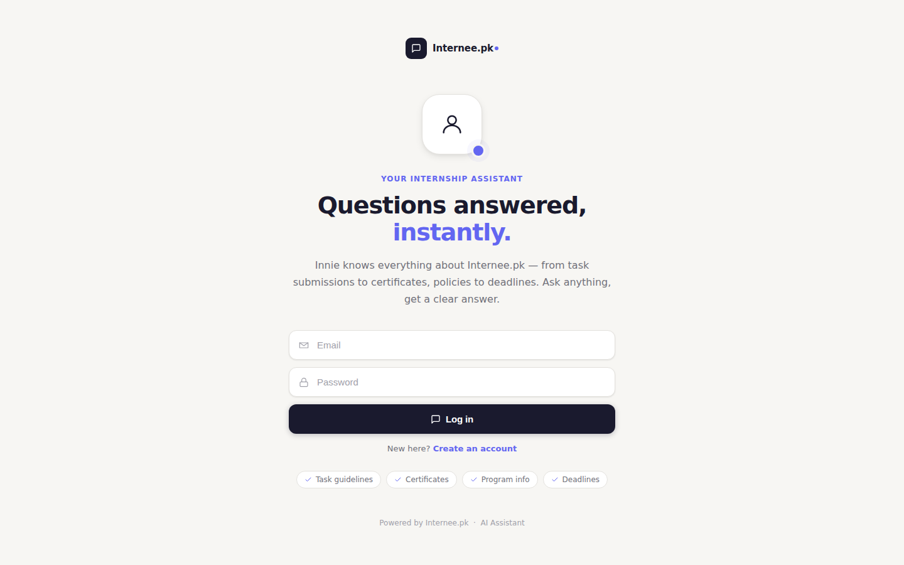
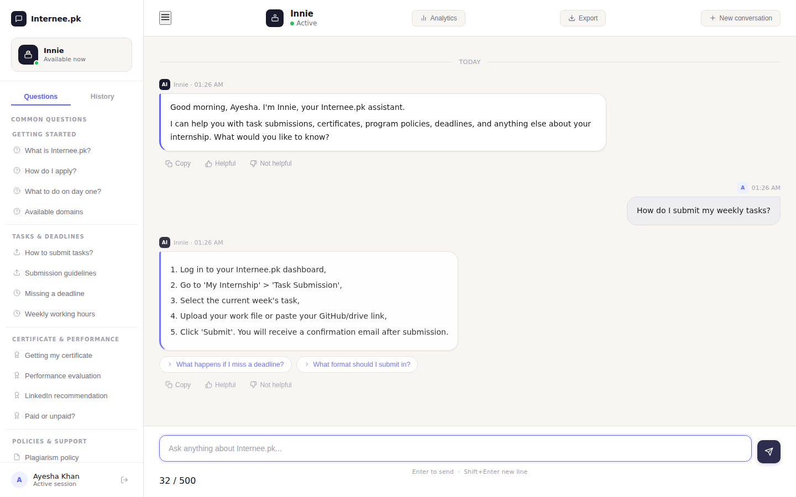
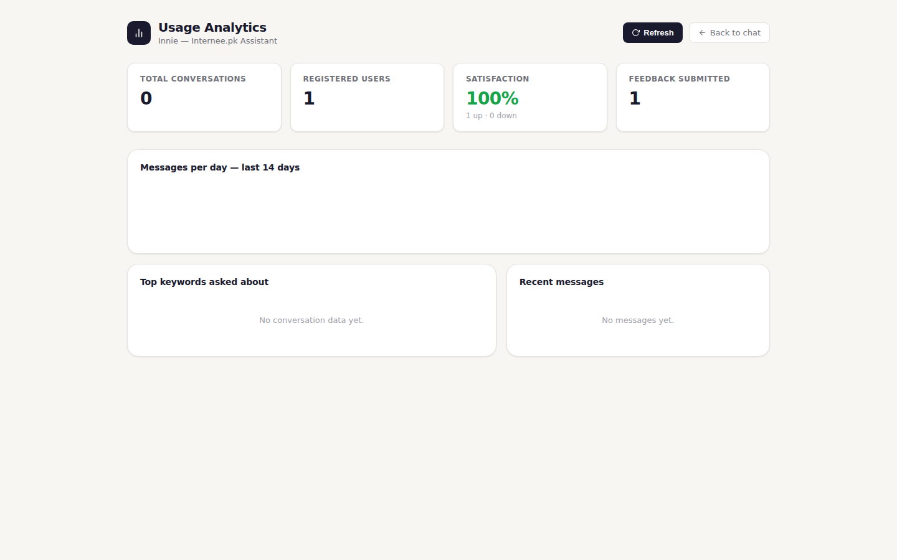

# Innie — Chatbot for Intern Queries
### Internee.pk AI Assistant | Built with Flask + Groq/OpenAI

---
Innie is an AI-powered chatbot assistant built for Internee.pk interns, providing instant 24/7 support for tasks, certificates, policies, and deadlines. Features include user authentication, conversation history, voice input, file attachments, and an admin analytics dashboard. Powered by Flask, Groq API (LLaMA 3.3 70B), and SQLite.

---
### Login Page


---

## ✨ Features

**Core chat**
- **Natural Language Understanding** — Answers intern questions using Groq (LLaMA 3.3 70B), with OpenAI as a fallback provider
- **Knowledge Base** — FAQs, policies, task guidelines, and contact info for Internee.pk
- **Local FAQ Fallback** — Still answers common questions even if the AI provider is down or rate-limited
- **Suggested Follow-ups** — Contextual one-click next questions after each answer
- **Quick Chips & FAQ Sidebar** — Browse and ask common questions instantly
- **Typing Indicator** — Realistic "Innie is typing…" state while waiting for a reply
- **Responsive UI** — Works on mobile and desktop

**Accounts & security**
- **User Authentication** — Signup/login/logout with hashed passwords (Werkzeug) and server-side sessions (Flask-Login)
- **Per-user Sessions** — Chat and feedback are tied to the logged-in account, not a typed-in name
- **Rate Limiting** — Per-IP request limits on chat, login, and signup endpoints
- **Input Sanitization** — Strips HTML tags and enforces message length limits

**Conversation history & search**
- **Persistent Chat History** — Every conversation is saved to the database, tied to your account
- **History Sidebar** — Browse past conversations by title, with timestamps and message counts; pick one up right where you left off (context included)
- **Search** — Full-text search across all your past messages, with results linking straight back to the source conversation
- **Delete Conversations** — Remove any past conversation permanently

**Feedback & analytics**
- **Message Feedback** — 👍 / 👎 on any bot response
- **Admin Usage Analytics Dashboard** — `/dashboard`, restricted to admin accounts (the first person to sign up becomes admin automatically). Shows total conversations, registered users, satisfaction %, most-asked keywords, a daily message volume chart, and a recent-messages feed.


## 🚀 Setup Instructions

### Step 1: Install Python dependencies
```bash
pip install -r requirements.txt
```

### Step 2: Add your API key
```bash
# Copy the example file
cp .env.example .env

# Open .env and add ONE of:
# GROQ_API_KEY=gsk-your-actual-key-here      (recommended, free tier available)
# OPENAI_API_KEY=sk-your-actual-key-here
```
Get a free Groq key at: https://console.groq.com
Get an OpenAI key at: https://platform.openai.com/api-keys

### Step 3: Run the app
```bash
python app.py
```
This auto-creates `data/users.db` on first run.

> ⚠️ If you're upgrading from an older version of this project and already have a `data/users.db` file, **delete it before the first run** — the database schema has changed (added `is_admin`, conversations, and messages tables) and Flask-SQLAlchemy won't auto-migrate an existing file. Deleting it means you'll need to sign up again, but it avoids `OperationalError: no such column` errors.

### Step 4: Open in browser
```
http://localhost:5000
```
Sign up for an account — the **first account created automatically becomes admin** and can view `/dashboard`.

---

### Chat with Typing Indicator



```
```
### Project Structure
```
intern-chatbot/
├── app.py                  # Flask server, auth, chat, analytics, conversation APIs
├── requirements.txt        # Python dependencies
├── .env.example             # Environment variable template
├── .env                     # Your actual secrets (create this)
├── data/
│   ├── knowledge_base.json # Internee.pk FAQs and policies
│   ├── users.db             # SQLite: users, conversations, messages (auto-created)
│   ├── conversations.json  # Legacy flat log, feeds the analytics dashboard
│   └── feedback.json       # Thumbs up/down feedback log
└── templates/
    ├── index.html          # Chatbot UI (auth + chat + history sidebar)
    └── dashboard.html      # Admin analytics dashboard
```


### Customization
```
```
### Add more FAQs

Edit `data/knowledge_base.json` and add entries to the `"faqs"` array:
```json
{
  "question": "Your new question?",
  "answer": "Your answer here."
}

```
### Change the AI model
In `app.py`, find `model="llama-3.3-70b-versatile"` (Groq) or `model="gpt-3.5-turbo"` (OpenAI) and swap for a different model.

### Update policies
Edit the `"policies"` section in `knowledge_base.json`.

### Make another user an admin
Currently only the first signup is auto-promoted. To promote another account manually:
```bash
python -c "from app import app, db, User; 
with app.app_context():
    u = User.query.filter_by(email='someone@example.com').first()
    u.is_admin = True
    db.session.commit()"
```

### Admin Dashboard


```
```
##  Tech Stack

| Tool | Purpose |
|------|---------|
| Flask | Python web framework |
| Flask-Login | Session-based authentication |
| Flask-SQLAlchemy | SQLite ORM (users, conversations, messages) |
| Flask-Limiter | Rate limiting |
| Groq / OpenAI API | AI language model |
| Chart.js | Analytics dashboard charts |
| Vanilla JS | Frontend chat interface |
| HTML/CSS | UI design |
| JSON | Knowledge base + legacy log storage |

---

*Built for Internee.pk internship task submission.*
